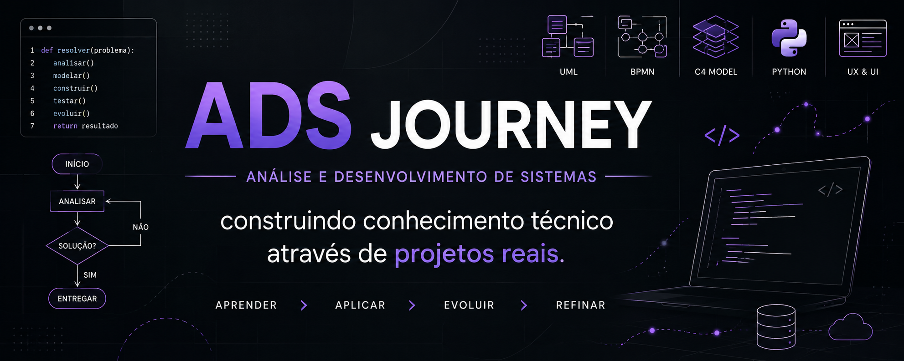

  

# 🎓 ADS Journey

Repositório dedicado à minha trajetória de aprendizado em Análise e Desenvolvimento de Sistemas (ADS), reunindo estudos, atividades acadêmicas, exercícios práticos e aplicações reais desenvolvidas ao longo da graduação.

Mais do que armazenar arquivos, este espaço documenta minha evolução técnica, construção de raciocínio analítico e aplicação prática dos conhecimentos em projetos reais.

---

## 📚 Áreas de estudo

### Engenharia de Software
- Levantamento de requisitos
- Modelagem de sistemas
- BPMN
- UML
- Casos de uso
- Arquitetura de software
- Modelo C4

### Desenvolvimento
- Algoritmos
- Lógica de programação
- Python
- Estruturas de código
- Resolução de problemas

### UX e Prototipagem
- Fluxo de usuário
- Wireframe
- Protótipos navegáveis
- Experiência do usuário
- Organização de informação

### Documentação Técnica
- Requisitos funcionais
- Requisitos não funcionais
- Diagramas técnicos
- Estudos estruturados
- Modelagem de solução

---

## 🚀 Aplicação prática dos estudos

Grande parte dos conhecimentos desenvolvidos durante a graduação está sendo aplicada diretamente em um projeto autoral:

### LYS — Lash Your Style

Aplicativo profissional voltado para lash designers com foco em:

- Análise técnica do olhar
- Construção personalizada de mapping
- Padronização técnica
- Apoio à tomada de decisão
- Simulação baseada em fios reais

O objetivo é transformar conhecimento técnico especializado em uma ferramenta digital de apoio profissional.

Este repositório documenta o aprendizado.

O projeto LYS concentra a aplicação prática.

➡️ Projeto principal:  

[Conhecer o projeto LYS](https://github.com/OiAline/Lash-Your-Style-APP)

---

## 📈 Evolução contínua

Este espaço será atualizado continuamente conforme novos conteúdos, projetos e conhecimentos forem desenvolvidos durante a graduação e estudos complementares.

---

## 🛠 Ferramentas utilizadas

- Figma
- GitHub
- Python
- Documentação técnica
- Métodos de engenharia de software

---

> Aprender → Aplicar → Evoluir → Refinar
